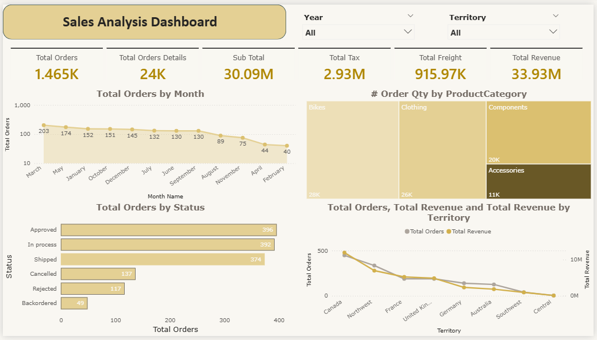

# 📊 AdventureWorks Sales Analysis Dashboard (Power BI)

## 📌 Overview

This project presents an interactive **Sales Analysis Dashboard** built using **Power BI** based on the AdventureWorks dataset.
The dashboard provides insights into sales performance, order behavior, product distribution, and regional performance.

---

## 🗂️ Data Source

* **Dataset:** AdventureWorks
* **File:** `Sales.xlsx`
* **Type:** Transactional Sales Data

Each record represents an order or order detail including product, quantity, pricing, and shipping information.

---

## 🧱 Data Modeling

The project follows the **Star Schema** approach:

### 🔹 Fact Table

* **FactSales**

  * SalesOrderID
  * SalesOrderDetailID
  * OrderDate
  * OrderQty
  * SubTotal
  * TaxAmt
  * Freight
  * TotalDue

### 🔹 Dimension Tables

* **DimProduct** (Category, SubCategory, Product)
* **DimDate** (Date, Month, Year)
* **DimTerritory** (Country/Region)
* **DimStatus** (Order Status)

---

## 🧩 Features

### 🔸 Product Hierarchy

* Category → SubCategory → Product
* Enabled **Drill Down** for deeper analysis

### 🔸 Measures Table (DAX)

All calculations are organized in a dedicated table:

* # Orders
* # Order Details
* Total SubTotal
* Total Tax
* Total Freight
* Total Due (Revenue)

---

## 📊 Dashboard Visuals

### 🔹 KPI Cards

* Total Orders: **1.46K**
* Order Details: **24K**
* SubTotal: **30.09M**
* Tax: **2.93M**
* Freight: **915.97K**
* Total Revenue: **33.93M**

---

### 🔹 Charts

* 📈 **Total Orders by Month**
  Displays a monthly trend of orders (declining pattern observed)

* 📊 **Orders by Status**
  Shows distribution of order states (Approved, Shipped, Cancelled, etc.)

* 🟨 **Order Quantity by Product Category**
  Bikes dominate sales compared to other categories

* 📉 **Orders vs Revenue by Territory**
  Compares performance across regions (Canada, Northwest, etc.)

---

## 📈 Key Insights

* 🚴 **Bikes** are the top-selling category
* 📉 There is a **declining trend in orders over time**
* 🌍 Sales performance varies by territory
* ✅ Most orders are successfully completed (low cancellation rate)

---

## 🎨 Dashboard Design

* Clean and modern layout
* Consistent color palette
* Focused on readability and user experience

---

## 🚀 Tools & Technologies

* Power BI Desktop
* DAX (Data Analysis Expressions)
* Microsoft Excel

---

## 📷 Dashboard Preview

---

## 📌 Author

**Mohamed Atef**  
Data Analyst | Power BI Developer  

---

## ⭐ Support

If you found this project helpful, feel free to ⭐ star the repository!
